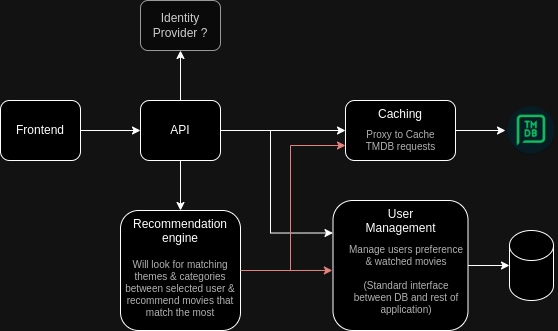

# WatchOurMovie (WOM)

WatchOurMovie est une application web qui propose aux utilisateurs des recommandations de films personnalisées en fonction de leurs préférences et de leur historique de visionnage.

## Architecture / Technologies utilisées



* **API** : FastAPI
* **Moteur de Recommandation** : Python
* **Frontend** : Angular
* **Caching** : cachetools
* **Fournisseur d'Identité** : Python (JWT)
* **Gestion des Utilisateurs** : Python
* **Base de Données** : MySQL

## Fonctionnalités

* **Recommandations Personnalisées** : En utilisant un moteur de recommandation sophistiqué, WatchOurMovie suggère des films adaptés aux goûts de chaque utilisateur.
* **Authentification et Autorisation des Utilisateurs** : L'authentification sécurisée des utilisateurs est gérée via Python avec gestion interne des JWT.
* **Caching Efficace** : Les requêtes sont mises en cache à l'aide de cachetools pour améliorer les performances et réduire les appels d'API redondants.
* **Gestion des Utilisateurs** : Les profils et préférences des utilisateurs sont gérés en interne.

## Prérequis
Avant de lancer l'application, assurez-vous d'avoir installé Docker et Docker Compose sur votre système.

## Installation et utilisation

### Clonez ce dépôt Git sur votre machine locale en utilisant la commande suivante :
```bash
git clone https://github.com/Tarchaud/Projet_WatchOurMovie.git
```

### Naviguez vers le répertoire cloné :
```bash
cd Projet_WatchOurMovie/
```

### Lancer l'application :
```bash
docker-compose up --build
```

### Arrêter l'application :
Ctrl+C ou 
```bash
docker-compose down
```

### Supprimer le cache et les volumes
```bash
docker-compose down --rmi all -v
```
